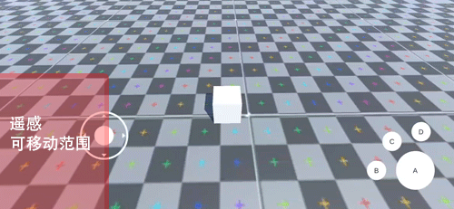
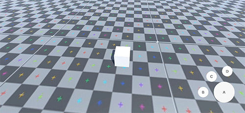

#Unity Joystick手势操作#
#
## 
本文实现了一个简易的Unity JoyStick手势操作，主要实现三个功能，操纵杆（Joystick）、相机旋转(Rotate)与缩放(Scale)。

基本逻辑结构如下：

	protected void LateUpdate()
	{
	     AroundByMobileInput();
	}
	
	void AroundByMobileInput()
	{
	    if (Input.touchCount > 0 && Input.touchCount <= 2)
	    {
	        for (int i = 0; i < Input.touchCount; i++)
	        {
	            if (Input.touches[i].phase == TouchPhase.Began)
	            {
	                判断可能存在缩放操作的计时标记
	
	                如果在屏幕左半边，则初始化Joystick
	                    记录触摸信息，包括位置、ID
	
	                如果在屏幕右半边，则初始化Rotate
	                     记录触摸信息，包括位置、ID
	                	 计时器增加 不能操作缩放
	            }
	            else if (Input.touches[i].phase == TouchPhase.Moved || Input.touches[i].phase == TouchPhase.Stationary)
	            {
	                根据ID来执行相应操作，Joystick还是Rotate操作
	
	                计时器操作
	            }
	            else if (Input.touches[i].phase == TouchPhase.Canceled || Input.touches[i].phase == TouchPhase.Ended)
	            {
	                同样根据ID来执行最后的收尾工作
	            }
	        }
	    }
	
	    根据计时器的时间判断是否可以进行缩放操作 canScale
	
		if (canScale)
		{
			双指缩放操作
		}
	}

手势操作的实现均是根据Unity提供的Input的TouchPhase来判断状态，然后三个主要功能Joystick、Rotate和Scale根据其状态和Input的Position变换等各种属性来进行操作。

Joystick的实现原理是记录触摸点第一帧的初始位置，显示操纵杆背景图。然后根据之后触摸的位置与初始位置间的相对位移计算出偏移量，即是主角需要使用的位移值，显示操纵杆。最后当触摸停止时候清空数据。

Rotate同理，也是根据触摸点第一帧的初始位置，与之后的位置的相对位移来计算相机的旋转量。

Scale则是根据两根手指触碰的距离与初始距离的相对大小来计算相机的位移。

##

三个主要功能的逻辑很简洁，但是编写过程中也遇到了一些问题。

###1.

手势操作需要兼容手指触碰和外设手柄。但是在使用外设手柄的时候有时候遇到Joystick卡住的问题，如图：

原因是在外设手柄或虚拟按键的时候，遥感的触碰事件初始获取的一定是设定的虚拟区域的中心位置，但由于使用了Input.touches.position，获取的是当前触摸的位置，当摇杆移动过快时，导致第一次获取的位置并不是虚拟区域的中心。把此点初始化成了摇杆的中心，而虚拟遥感的移动位置无法超过虚拟区域，造成遥感被卡住。

而Unity提供了另外一个方法Input.touches.rawPosition，这个方法获取的是触摸事件的初始值。

更改为这个方法之后，再使用外设手柄的时候，Joystick的初始化位置就固定为手机设定的初始位置，如图：

 
rawPosition是触摸事件的初始位置，而position是当前移动到的位置。

###2.

手势操作与UI布局有时会产生冲突，如图：

针对这个问题，Unity已提供很好的解决方法。Unity提供了EventSystem.IsPointerOverGameObject来判断手势操作是否点击到了UI上。直接在初始化操作的时候增加一个判断即可

    if (!EventSystem.current.IsPointerOverGameObject(Input.touches[i].fingerId))

EventSystem.current.IsPointerOverGameObject方法针对的是Unity提供UGUI的，并且需要勾选组件上的Raycast Target才能生效。

修改后点击按钮与手势操作不再冲突，如图：

###3.

Rotate操作最初使用的是Input.GetAxis接口来判断相机的旋转角度。缺点是，需要多点操作的时候，由于这个接口并没有细化到是第几个手指触碰。所以如果同时有两个手指触碰屏幕的时候，Joystick和Rotate操作会冲突，如图：

 
因此将Input.GetAxis接口换成Input.touches的操作。因为Input.touches可以判断是触碰点的位置和顺序，然后根据ID和顺序限制触碰点只能单独进行Joystick操作或者Rotate操作，根据Input.touches.position的变换来计算旋转角度。

问题解决，如图：

###4.

Joystick操作中，操作杆的位置需要在背景图的范围之内。

使用Unity也提供的接口RectTransformUtility.ScreenPointToLocalPointInRectangle，该方法是将屏幕空间上的点转换为RectTransform的局部空间中位于其矩形平面上的位置。

代码如下，其中m_OnPad传入是Joystick的背景GameObject，touchPosition是触碰的位置，即将当前Joystick的触碰位置传入，转换成背景图的RectTransform局部空间的坐标。

    Vector2 convertTouchPosToUIPos(Vector2 touchPosition)
    {
        Vector2 localPoint;
        RectTransformUtility.ScreenPointToLocalPointInRectangle(m_OnPad.transform as RectTransform, touchPosition, null, out localPoint);
        return localPoint;
    }

然后，在显示Joystick的操作杆位置的时候，然后限定局部坐标的位置与中心的距离，就可以将操作杆设置在圆盘的范围内。代码如下，其中m_CenterPos是触碰第一帧的时候记录的初始化坐标，也需要转换成局部坐标。

	void setStickCenterPos(Vector2 touchPosition)
    {
        Vector2 pos = convertTouchPosToUIPos(touchPosition);

        float dis = Vector2.Distance(pos, m_CenterPos);
        if (dis > m_DisLimit)// 限定局部坐标的位置与中心的距离
        {
            Vector2 dir = pos - m_CenterPos;
            dir.Normalize();
            dir *= m_DisLimit;
            pos = m_CenterPos + dir;
        }
        m_Stick.transform.localPosition = pos;
    }

###5.

Joystick与Scale和Rotate冲突，即在两个手指同时操作的情况下，三个操作同时进行，如图：

而解决问题很简单，则是考虑到需求，将需要双指操作的Scale操作和两个单指操作的Joystick移动和Rotate区分开来即可。原理是使用一个计时器记录两个触碰点的间隔时间，如果这个时间超过了0.1s，则禁止Scale操作；同样如果在Scale操作的时候也禁止Joystick和Rotate操作。同时，如果需要的话可以更进一步限制双指操作只在屏幕右半边才有效。

修改之后问题解决，如图：

###6.
为每种操作记录相应的Input.touches[i].fingerId，以便下帧使用时可以获取相同的操作的触摸点。
 
 

